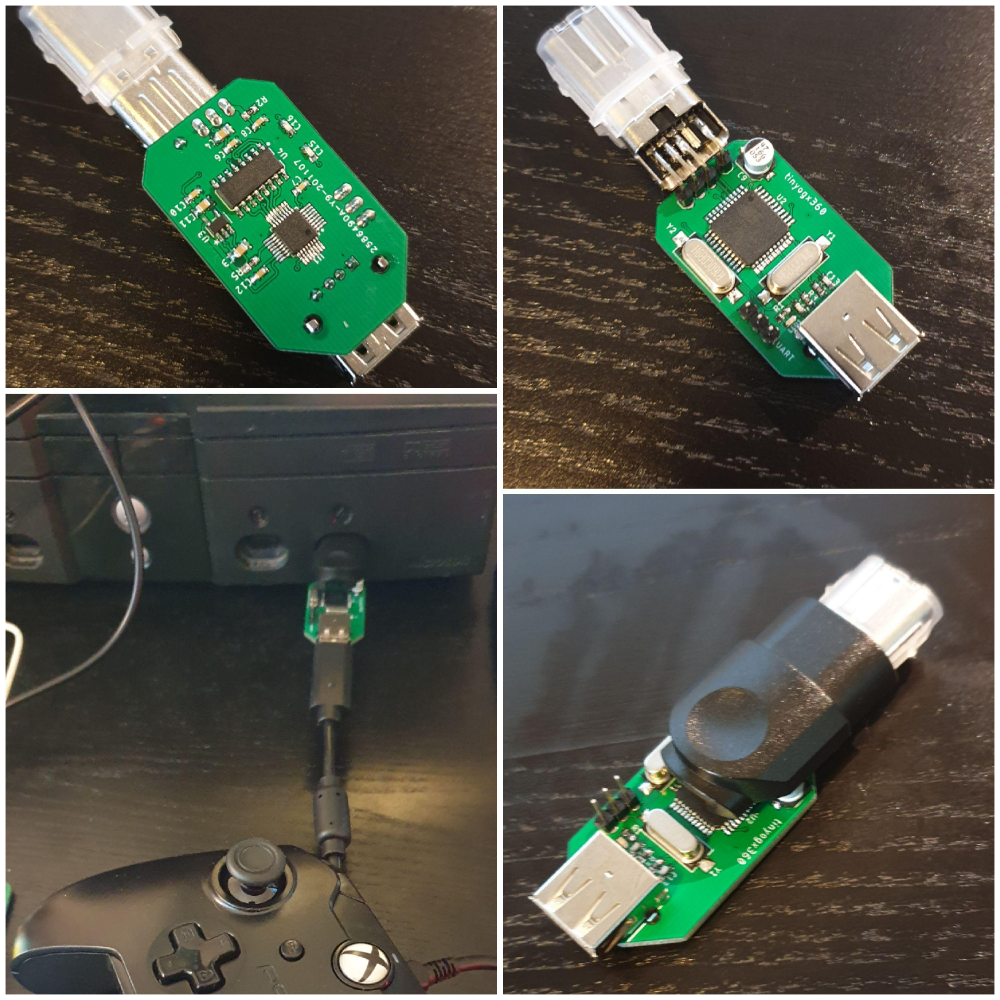
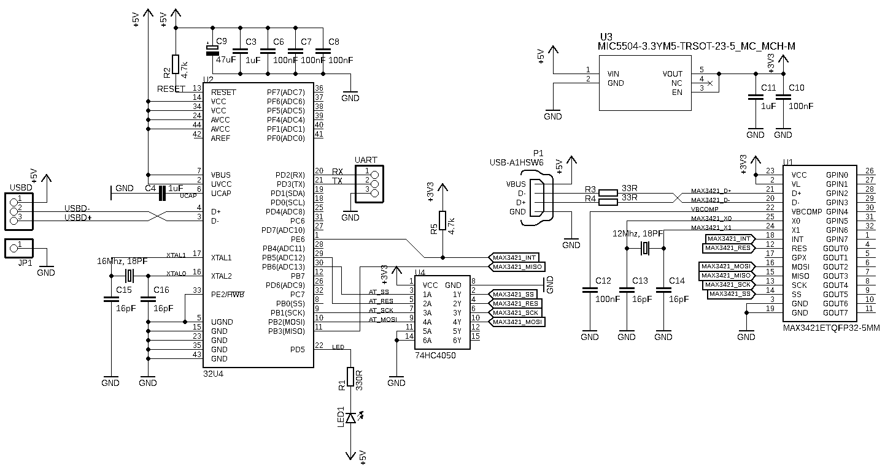

# tinyogx360 - Overview

The tinyogx360 is a variation of my [ogx360](https://github.com/Ryzee119/ogx360) project, just a much smaller single player version. It is a circuit board which allows you to use a range of modern USB controllers on the Original Xbox Console. **Note the warnings below prior to building.**

See the main [ogx360 repo](https://github.com/Ryzee119/ogx360) for device firmware. This repo just constains the hardware design files.

This was created using [Autodesk Eagle.](https://www.autodesk.com/products/eagle/overview)

  

## Ordering
* The PCB Gerbers and BOM are located [here](./.kitspace/).
* These can easily be ordered via [kitspace](https://kitspace.org/boards/github.com/ryzee119/tinyogx360).
* 3D model of the PCB is [here](https://a360.co/2P1Qr6T) (Fusion360).
* You will also need to grab a  [Xbox Controller Port USB adaptor cable](https://www.aliexpress.com/wholesale?catId=0&SearchText=original+xbox+to+usb+adapter) to salvage the connector.

## Schematic

## WARNING
* Released by request. This is not as tested or as user friendly as the main ogx360 board. You should be comfortable with self-debugging.
* The board does not have any programming headers. The Atmega32u4s should come from factory with a DFU bootloader which can be programmed via the xbox side USB connector.
* I didnt have much luck with this so I hacked on a ISP programming header and programming via TinyISP or any AVR programmer.
* Alternatively program it externally.

By Ryzee119
